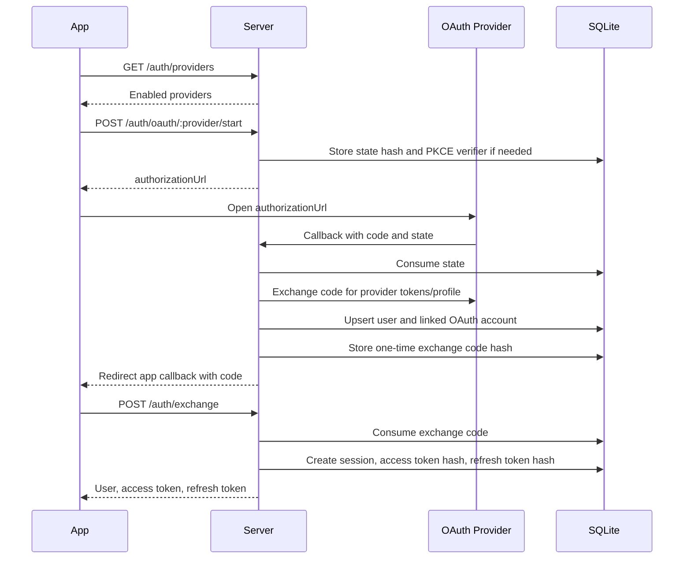
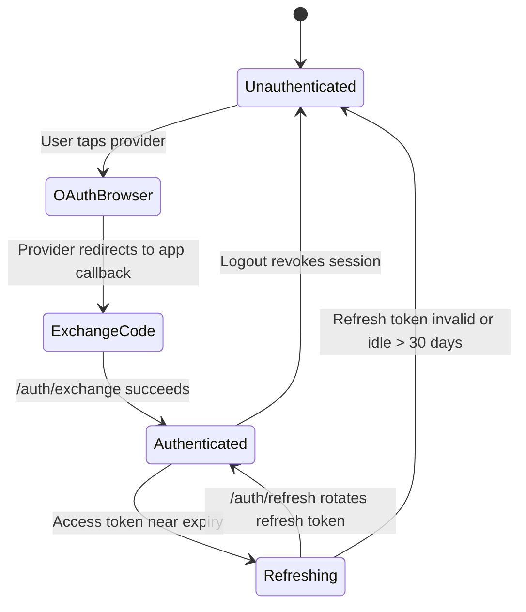
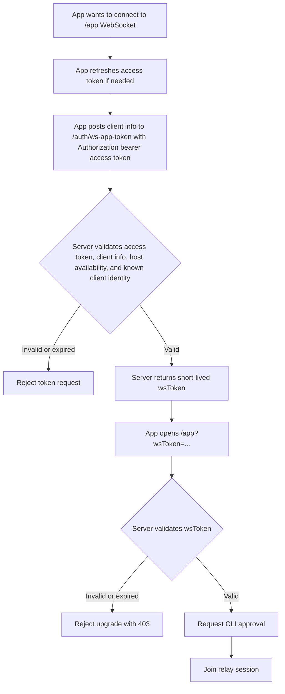
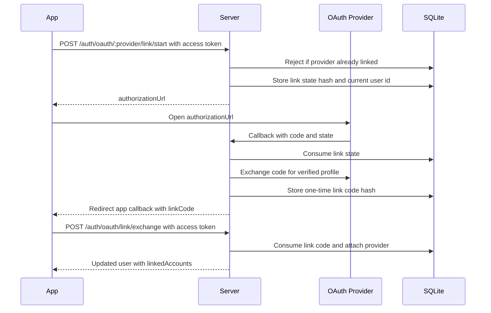

# Shellular OAuth Flow

Shellular requires app users to sign in before onboarding, host pairing, or app WebSocket access. The CLI host registration flow remains unauthenticated for now.

## Configuration

Copy `.env.example` to `.env` and configure the provider credentials you want to enable. A provider is shown by `GET /auth/providers` only when all required values for that provider are present.

Required base settings:

- `NODE_ENV`: `dev` or `prod`.
- `AUTH_PUBLIC_BASE_URL`: public server origin used for OAuth callback URLs, for example `https://api.shellular.dev`.
- `AUTH_APP_CALLBACK_URL`: app deep link used after OAuth completes, usually `shellular://auth-callback`.
- `CORS_ORIGIN`: app/web origin allowed to call the API.

Provider settings:

- Google: `GOOGLE_CLIENT_ID`, `GOOGLE_CLIENT_SECRET`.
- GitHub: `GITHUB_CLIENT_ID`, `GITHUB_CLIENT_SECRET`.
- Apple: `APPLE_CLIENT_ID`, `APPLE_TEAM_ID`, `APPLE_KEY_ID`, plus the `server/apple_key.p8` file.

For Apple, the private key is the PKCS#8 `.p8` file from Apple Developer. Place it at `server/apple_key.p8`; this file is ignored by git and read directly by the server.

Provider redirect URLs to register:

- Google: `{AUTH_PUBLIC_BASE_URL}/auth/oauth/google/callback`
- GitHub: `{AUTH_PUBLIC_BASE_URL}/auth/oauth/github/callback`
- Apple: `{AUTH_PUBLIC_BASE_URL}/auth/oauth/apple/callback`

## Login Sequence

The app receives only a short-lived exchange code through the callback URL. Access and refresh tokens are returned only through the direct `/auth/exchange` API call.

Android debug builds send `shellular-dev://auth-callback` when starting OAuth so they can coexist with the production app without Android showing an app chooser. The server stores the requested app callback URL with the OAuth state and falls back to `AUTH_APP_CALLBACK_URL` for older clients or invalid callbacks.

Browser builds cannot receive custom URL schemes, so they send a same-origin callback URL with `shellularAuthCallback=1`, for example `https://app.shellular.dev/?shellularAuthCallback=1`. For browser sign-in, the server completes the OAuth callback itself, creates the Shellular session, sets HttpOnly Secure SameSite=None cookies on the API origin, and redirects the popup back to the app callback. The original browser tab then refreshes `/auth/me` with `credentials: include`. The popup callback still posts a lightweight completion signal and closes, but it no longer carries access or refresh tokens.

## Token Lifecycle

Access tokens expire after 15 minutes. Refresh tokens rotate on every refresh and expire after 30 days of inactivity. Server-side token storage uses SHA-256 hashes of opaque random tokens, so raw tokens are never stored in SQLite.

## WebSocket Enforcement

Only the app WebSocket path requires OAuth. The `/cli` WebSocket path and `/host/register` flow are intentionally unchanged.

## Account Linking

During normal sign-in, OAuth identities are still resolved by verified email:

- If an OAuth provider returns an existing verified email, the provider account is attached to that Shellular user.
- If the email is new, the server creates a new Shellular user.
- If no verified email is returned, login fails with an app-facing error.

The first OAuth account linked to a Shellular user is the primary account. The primary account anchors the user's Shellular email, display name, and avatar, and it cannot be unlinked.

Secondary provider emails may differ from the primary email because the user proves control of the provider during OAuth. A secondary OAuth identity cannot be linked if it is already attached to another Shellular user. Users may unlink secondary providers with `DELETE /auth/oauth/accounts/:provider`; unlinking affects future sign-in options only and does not revoke the current Shellular session.

## Logout And Revocation

`POST /auth/logout` revokes the active session and all access/refresh tokens for that session. The app also removes the native refresh token from secure storage and returns to the login gate.
